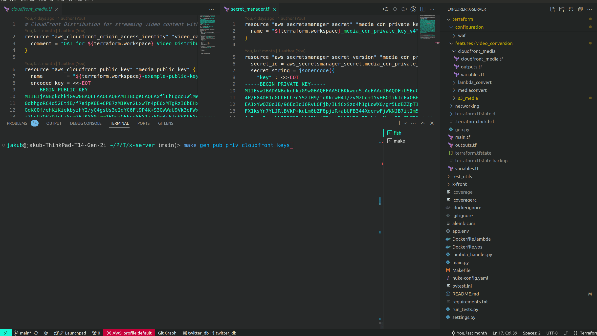

# Welcome to the FullStack AWS Application

Welcome to FullStack application, a robust example designed to showcase the integration of modern full-stack development practices on AWS. This application utilizes Python and TypeScript, coupled with the terraform managed infrastructure of AWS, to deliver a scalable and secure user experience.

# Quick Start Guide

This quick start guide will help you get the application up and running on your local development environment. Follow these steps to set up both the frontend and backend components.

## Running the Frontend

1. **Navigate to the Frontend Directory**:
    Open a terminal and change directory to the frontend folder:
    ```bash
    cd x-front
    ```

2. **Install Dependencies**:
    Ensure that you have Node.js and npm installed, then run:
    ```bash
    npm install
    ```

3. **Configure Axios**:
    Before starting the server, open the Axios configuration file and ensure the base URL points to your local server:
    ```javascript
    baseURL = 'http://localhost:8080/v1';
    ```

4. **Start the Frontend Server**:
    Run the following command to start the frontend:
    ```bash
    npm run dev
    ```
    


## Setting Up and Running the Backend

1. **Configure Local Development**:
    - Open the `settings.py` file located in your root folder directory.
    - Set the `LOCAL_DEVELOPMENT` flag to `True` to configure the application to run with settings suitable for local development.
      ```python3
      # NOTE Switch to local development if you re running the backend core locally
      LOCAL_DEVELOPMENT = True
      ```    
2. **Configure AWS Credentials Profile**:
    - initialize ~/.aws/credentials by running 
      ```bash
      aws configure
      ```
    - Make sure to update the ***app.env*** with the proper AWS `REGION_NAME` and `AWS_PROFILE`
    
2. **Start the PostgreSQL Database**:
    - Ensure Docker is installed and running on your machine.
    - Open a terminal and run the PostgreSQL container:
      ```bash
      make postgres
      ```

3. **Run the Backend**:
    - Navigate to the backend directory.
    - Install the required Python packages. It is recommended to use a virtual environment and Python version that matches the Dockerfile >= 3.11:
      ```bash
      pip install -r requirements.txt
      ```
    - Start the backend server:
      ```bash
      python main.py
      ```
      

## Load Postman Collection
  <details>
  <summary><strong>Show Load Collection</strong></summary>

  

  </details>

## Running Backend Tests Locally

1. **Set Up the Test Database**:
    - To run the backend tests, you need a separate PostgreSQL instance. Start the mock PostgreSQL container:
      ```bash
      make mockpostgres
      ```
    - Create the test database:
      ```bash
      make createmockdb
      ```

2. **Configure Testing Environment**:
    - Ensure the `ENVIRONMENT` is Environment.Testing or "Testing"
    
3. **Execute Tests**:
    - Run the tests by executing:
      ```bash
      make test
      ```
    - Run the tests and generate coverage report:
      ```bash
      make coverage
      ```
      


## Overview

This application combines the efficiency of FastAPI and the flexibility of NextJS to create a dynamic full-stack solution. It is specifically designed to showcase essential features like user authentication, admin user management, and a user profile section where individuals can edit their profiles and upload media, such as videos.

## Key Features

- **User Authentication**: Secure and robust authentication system to manage user access.
- **Admin User Management**: Administrative features that allow for the management of user accounts.
- **Profile Management**: Users can easily edit their profiles and manage personal information.
- **Media Upload**: Users can upload videos, which are then processed and optimized for delivery.

## Backend

The backend of this application is built using **Python with FastAPI** and **SqlModel ORM**, creating an asynchronous webserver that is both fast and efficient. It includes:

- **AWS ECS Deployment**: The application is deployed on AWS ECS (Elastic Container Service) with support from ALB (Application Load Balancer) and WAF (Web Application Firewall) for enhanced security.
- **Database**: Utilizes PostgreSQL for reliable data storage.
- **Media Handling**: Integration with AWS MediaConvert for converting uploaded media to desired formats and parameters, managed by AWS Lambda for seamless media job triggering.

## Storage

- **AWS S3**: All media files are securely stored on AWS S3 and served through AWS CloudFront to ensure fast and secure access.

## Frontend

- **Hosting**: The frontend is hosted statically on an S3 Bucket, leveraging AWS CloudFront for efficient content delivery.

## Security

- **Route 53**: Manages SSL/TLS certificates, enhancing the security and reliability of the application.
- **WAF Integration**: Protects the application from web threats and DDoS attacks, ensuring uptime and data integrity.

This project also incorporates IaC practices through the use of Terraform for infrastructure management and GitHub workflows for CI/CD, reinforcing the code-to-cloud automation philosophy.

Thank you for your visit. Dive into the documentation to set up, and explore how this application can be adapted and expanded to meet your needs.


# Terraform Deployment Steps

- **`1) Build Infrastructure`**: This step creates AWS resources using Terraform's Infrastructure as Code (IaC) configuration files.
  <details>
  <summary><strong>Show Build Infrastructure</strong></summary>

  

  </details>
  
  **Note**: Some modules may take longer to create and few will fail:
   - module.certificates.aws_acm_certificate_validation.szumi_dev_cert_validation
   - module.certificates.aws_acm_certificate_validation.szumi_dev_cert_validation_us_east_1`
   - Issue when creating Lambda Function (`dev_media_convert_trigger`): "operation error Lambda: CreateFunction: Provide a valid source image."
   
   To fix issues above:

- **`2) Change Domain Server Names`**: Update the DNS settings at Domain Provider to point to AWS Route 53, facilitating the resolution of the `aws_acm_certificate_validation` challenge.
  <details>
  <summary><strong>Show Change Domain Server Names</strong></summary>

  

  </details>

- **`3) Push Docker Images`**: Upload the Docker images for the media converter and core backend to your AWS ECR image registry.
  <details>
  <summary><strong>Show Push Docker Images</strong></summary>

  
  
  

  </details>

- **`4) Apply Terraform Once Again`**: After DNS updates and certificate validations, reapply Terraform. If errors persist, allow some time for settings to propagate before retrying.

# CI/CD GitHub Configuration

To enable automatic updates of the ECS service and tasks via the CI/CD pipeline upon a Git push, you need to configure several secrets within GitHub. These secrets facilitate GitHub Actions to update AWS ECS and Lambda for continuous deployment.

## Setting Up AWS User

Before populating GitHub secrets, create an AWS user with the necessary permissions to provision all the required resources. This user’s credentials will be used to authenticate and authorize operations initiated by GitHub Actions.

1. **Create an AWS IAM user** with programmatic access. This will generate an `AWS_ACCESS_KEY_ID` and `AWS_SECRET_ACCESS_KEY`.
2. **Attach policies** that grant the user sufficient permissions to manage ECS, Lambda, and other AWS services involved in your deployment.

## Populating GitHub Secrets

Once the AWS user is set up, you'll need to add these credentials to your GitHub repository as secrets:

- `AWS_ACCESS_KEY_ID`: The access key ID from your AWS IAM user.
- `AWS_SECRET_ACCESS_KEY`: The secret access key corresponding to the above ID.

  <details>
  <summary><strong>Show Create IAM User</strong></summary>

  

  </details>

  <details>
  <summary><strong>Show Create User Keys</strong></summary>

  

  </details>


***Please note*** that I have opted to grant the 'AdministratorAccess' policy to our Terraform user as a temporary shortcut. Ideally, access should be restricted and limited to only those resources necessary for provisioning the infrastructure.

Additionally, retrieve other necessary secrets from the Terraform outputs:

- Navigate to the root of your Terraform project.
- Run `terraform output` to fetch most of the variables needed.
- If some variables are missing, add them to `outputs.tf` to ensure they are outputted by Terraform.

```bash
terraform output
```


**Current Support in CI/CD**:

**`Important`**: Currently, the CI/CD pipeline only supports the Lambda converter and the core ECS backend. The frontend and Terraform infrastructure are not integrated into the CI/CD process and must be deployed manually.

# Next Steps
- **`1) Deploy static frontend`**: The script updates an AWS S3 bucket with static files from a local directory, specifically configured for hosting a Next.js website. First we run `npm run` build then `update-front` makefile command.
  <details>
  <summary><strong>Show Build Frontend</strong></summary>

  

  </details>

  <details>
  <summary><strong>Show Update Frontend</strong></summary>

  

  </details>

- **`1) Verify Resource URLs`**: Lastly verify that your ecs container and cloudfront works. `Please adjust the urls to match your domain`.
  <details>
  <summary><strong>Show Verify Resource URLs</strong></summary>

  

  </details>


# Makefile Overview
This Makefile is designed to streamline various development, testing, and deployment operations for a software project using Docker, AWS, and PostgreSQL. Below are the detailed sections covering each aspect of the Makefile.

<details>
<summary><strong>Docker and Database Operations</strong></summary>

### Docker and Database Operations
- **`postgres`**: Runs a Docker container named `postgres` on port 5432 with PostgreSQL version 14 and default credentials.
- **`createdb`**: Creates a database named `twitter_db` within the `postgres` container.
- **`mockpostgres`**: Runs a Docker container named `mockpostgres` for testing purposes with separate credentials and database.
- **`createmockdb`**: Creates a test database named `testdb` in the `mockpostgres` container.

</details>

<details>
<summary><strong>Testing and Coverage</strong></summary>

### Testing and Coverage

- **`cov`**: Executes tests using `pytest` with coverage tracking.
- **`html`**: Generates an HTML report of the code coverage.
- **`coverage`**: Combines the `cov` and `html` commands to provide complete coverage reporting.
- **`test`**: Runs a Python script to execute unit tests.

</details>

<details>
<summary><strong>AWS and Docker Workflow</strong></summary>

### AWS and Docker Workflow

- **`build-lambda`**: Builds a Docker image for AWS Lambda deployment using a specific Dockerfile.
- **`build-vps`**: Builds a Docker image for VPS deployment with a different Dockerfile.
- **`login`**: Authenticates with AWS ECR using the AWS CLI.
- **`tag-lambda`**: Tags the built Lambda image for pushing to AWS ECR.
- **`tag-vps`**: Tags the built VPS image for pushing to AWS ECR.
- **`push-lambda`**: Pushes the tagged Lambda image to AWS ECR.
- **`push-vps`**: Pushes the tagged VPS image to AWS ECR.
- **`deploy-lambda`**: Full workflow to build, tag, and push a Lambda image.
- **`deploy-vps`**: Full workflow to build, tag, and push a VPS image.

</details>

<details>
<summary><strong>Frontend Operations</strong></summary>

### Frontend Operations

- **`front-images`**: Copies static frontend images to an S3 bucket.
- **`update-front`**: Synchronizes the frontend build output to an S3 bucket and modifies paths.
- **`invalidate`**: Invalidates a CloudFront distribution to clear cached content.

</details>

<details>
<summary><strong>Converter Lambda Operations</strong></summary>

### Converter Lambda Operations

- **`build-converter-lambda`**: Builds a Docker image for a media converter Lambda.
- **`tag-converter-lambda`**: Tags the converter Lambda image for ECR.
- **`push-converter-lambda`**: Pushes the tagged converter Lambda image to ECR.
- **`deploy-converter`**: Complete build, tag, and push workflow for the converter Lambda.

</details>

<details>
<summary><strong>Utility Operations</strong></summary>

### Utility Operations

- **`nuke`**: Executes the `aws-nuke` command to remove AWS resources based on a configuration file.
  <details>
  <summary><strong>SHOW NUKE</strong></summary>

  

  </details>
  
- **`infracost`**: Runs cost estimation for the infrastructure using Infracost.
  <details>
  <summary><strong>SHOW INFRACOST</strong></summary>

  

  </details>
- **`alembic`**: Generates a new database migration with Alembic.
- **`pycache`**: Clears Python cache files from the project directory.
- **`delete-secret`**: Deletes a specific AWS Secrets Manager secret.
- **`gen_pub_priv_cloudfront_keys`**: Generates a new pair of RSA keys for CloudFront.
  <details>
  <summary><strong>GEN KEYS</strong></summary>

  

  </details>
- **`gen_dummy_signed_url`**: Generates a signed URL for CloudFront using the generated keys.

</details>

<br></br>

# Application Showcase

<details>
<summary><strong>Singup / Profile</strong></summary>


</details>

<details>

<summary><strong>Media upload</strong></summary>


</details>

<details>

<summary><strong>Video Feed</strong></summary>


</details>


<br></br>
---
# NOTE

Currently, the PostgreSQL database is exposed to the internet, configured for debugging purposes to allow direct connections without a jump host. For production environments, it is advisable to remove this exposure to mitigate security risks.

```terraform
  ingress {
    from_port   = 5432
    to_port     = 5432
    protocol    = "tcp"
    cidr_blocks = ["0.0.0.0/0"]
  }
```